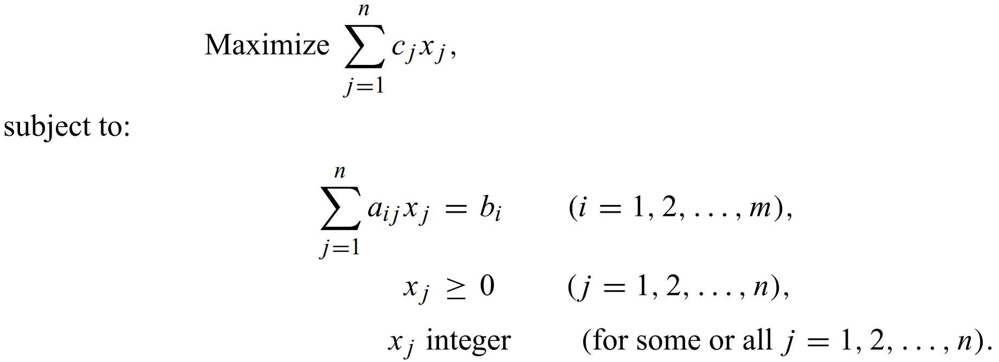

# ML is Solved by Optimization

* Try to minimize loss function
* Solve by gradient descent

# Combinatorial Optimization

# Examples

# TSP

# Bin-Packing

# SOTA Algorithm
* Branch and Bound (with heuristics)

# Randomization Algorithms
* Simulated Annealing
* Genetic Algorithms
* Ant Colony Optimization
* Particle Swarm Optimization 

# Machine Learning Approachs

# Imitation Learning
* Pre-calculate heuristics (computationally expensive)
* Train the heuristics set and predict later on

# Reinforcement Learning
* Tryout the policy set to get reward
* Using reward to boost policy selection

# Sequence-to-Sequence
* Solve a set of small problem
* Train with sequence-to-sequence model
* Predict on big problem

# Convolutional Neural Network

# Summary
